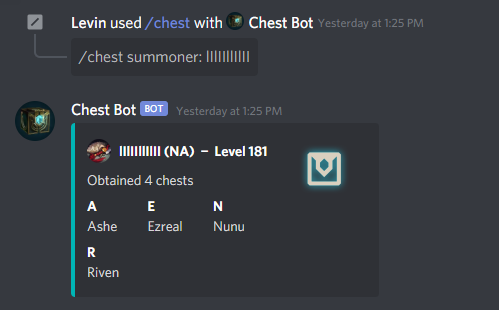

# chestbot
League of Legends chest tracker for Discord.

## Dependencies
* discordrb [branch](https://github.com/shardlab/discordrb/tree/5b0c4c81abe64056ef94fc82bd28fcd7774e724e)
* ruby-lol [branch](https://github.com/pmcnano/ruby-lol/tree/feature/api-v4-bump)

## Usage
ChestBot follows the syntax of Discord slash commands. More information about slash commands can be found in the [Discord API](https://discord.com/developers/docs/interactions/slash-commands).

**/chest** - Displays the chests obtained for a summoner
* ex: ```/chest summoner: lIlIIllIlII region: NA```

## Preview


## Disclaimer

ChestBot isn't endorsed by Riot Games and doesn't reflect the views or opinions of Riot Games or anyone officially involved in producing or managing Riot Games properties. Riot Games, and all associated properties are trademarks or registered trademarks of Riot Games, Inc.
